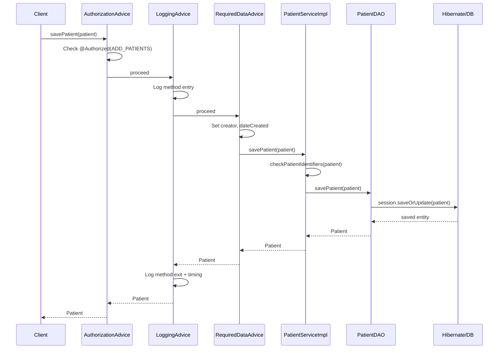
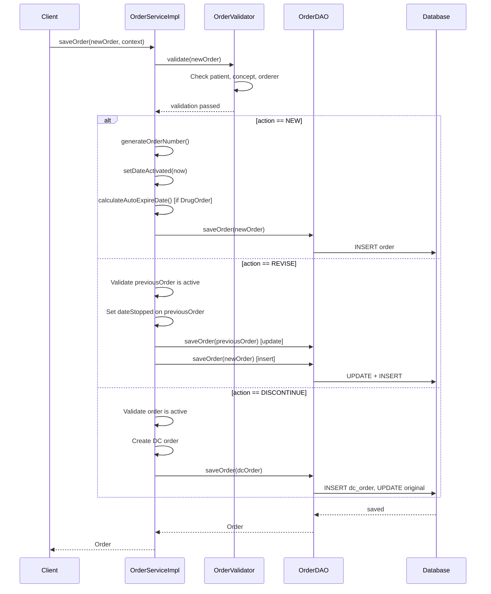

# Behavioral Diagrams — OpenMRS Core 2.0.3

## Patient Registration Sequence



## Order Placement and Revision Sequence



## HL7 Message Processing Activity

```
┌─────────────────┐
│ HL7 Message      │
│ Received         │
└────────┬────────┘
         ▼
┌─────────────────┐
│ Store in         │
│ HL7InQueue       │
└────────┬────────┘
         ▼
┌─────────────────┐
│ ProcessHL7Task   │
│ (Scheduled)      │
└────────┬────────┘
         ▼
┌─────────────────┐
│ Parse HL7        │
│ (HAPI Library)   │
└────────┬────────┘
         ▼
┌─────────────────┐       ┌──────────────┐
│ Determine        │──────→│ ADT^A28      │
│ Message Type     │       │ Handler      │
└────────┬────────┘       │ → Create     │
         │                │   Patient     │
         │                └──────────────┘
         │
         ├───────────────→┌──────────────┐
         │                │ ORU^R01      │
         │                │ Handler      │
         │                │ → Create     │
         │                │   Encounter  │
         │                │   + Obs      │
         │                └──────────────┘
         ▼
    ┌──────────┐     ┌──────────────┐
    │ Success? │──No→│ Move to      │
    └────┬─────┘     │ HL7InError   │
         │Yes        └──────────────┘
         ▼
    ┌──────────────┐
    │ Move to      │
    │ HL7InArchive │
    └──────────────┘
```

## Program Workflow State Machine

```
┌──────────────┐
│  Enrolled    │ ← PatientProgram.save()
│  (initial)   │
└──────┬───────┘
       │ transitionToState()
       ▼
┌──────────────┐
│  State A     │ ← ProgramWorkflowState
│  (active)    │
└──────┬───────┘
       │ transitionToState()
       ▼
┌──────────────┐
│  State B     │ ← New ProgramWorkflowState
│  (active)    │
└──────┬───────┘
       │ transitionToState() or complete program
       ▼
┌──────────────┐
│  Terminal    │ ← isTerminal=true
│  State       │
└──────┬───────┘
       │ completeProgram()
       ▼
┌──────────────┐
│  Completed   │ ← dateCompleted set
└──────────────┘

Rules:
- States must belong to the program's workflow
- Only one active state per workflow at a time
- Terminal states automatically trigger program completion
- ConceptStateConversion can auto-transition based on concept
```

## Application Startup Flow

```
┌─────────────────────┐
│ Servlet Container    │
│ starts webapp        │
└──────────┬──────────┘
           ▼
┌─────────────────────┐
│ Listener.context     │
│ Initialized()        │
└──────────┬──────────┘
           ▼
┌─────────────────────┐     ┌──────────────────┐
│ Runtime properties   │──No→│ StartupFilter →  │
│ exist?               │     │ InitializationF. │
└──────────┬──────────┘     │ (Setup Wizard)   │
           │Yes              └──────────────────┘
           ▼
┌─────────────────────┐     ┌──────────────────┐
│ Database needs       │──Yes│ UpdateFilter     │
│ update?              │────→│ (Liquibase Run)  │
└──────────┬──────────┘     └──────────────────┘
           │No
           ▼
┌─────────────────────┐
│ Create Spring        │
│ ApplicationContext   │
└──────────┬──────────┘
           ▼
┌─────────────────────┐
│ Start Modules        │
│ (ModuleFactory)      │
└──────────┬──────────┘
           ▼
┌─────────────────────┐
│ Start Scheduler      │
└──────────┬──────────┘
           ▼
┌─────────────────────┐
│ Application Ready    │
└─────────────────────┘
```

## Related Documentation

- [Structural Diagrams](../structural/structural-diagrams.md)
- [Architecture Diagrams](../architecture/architecture-diagrams.md)
- [Workflows](../../behavior/workflows.md)
