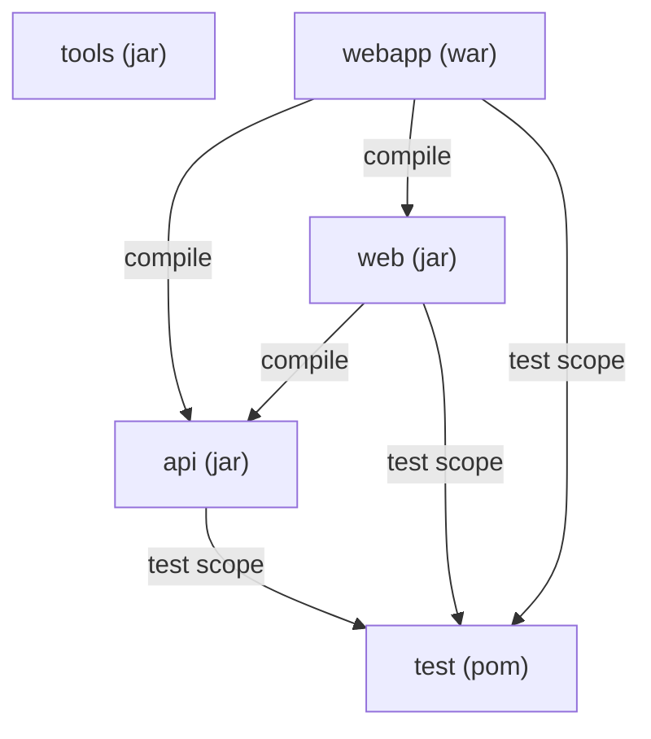
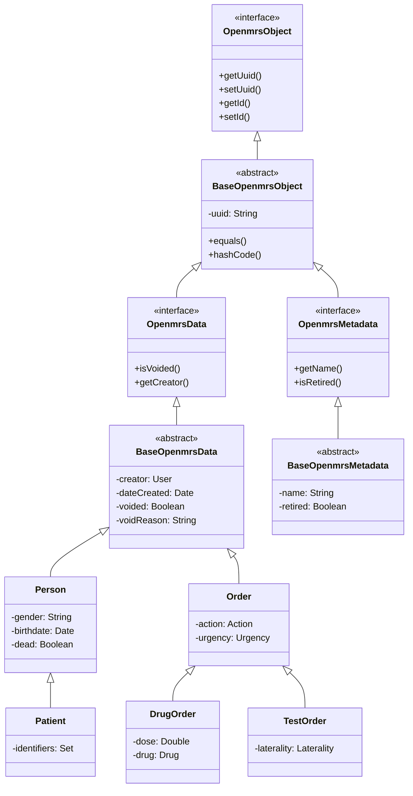

# Structural Diagrams — OpenMRS Core 2.0.3

## Maven Module Dependency Diagram



## Component Diagram — Layered Architecture

```
┌─────────────────────────────────────────────────────────────────────┐
│                         webapp (WAR)                                 │
│  ┌───────────────────────────────────────────────────────────────┐  │
│  │                    Web Layer (web module)                      │  │
│  │  ┌──────────┐ ┌──────────────┐ ┌──────────────┐             │  │
│  │  │ Filters  │ │ Controllers  │ │  Servlets     │             │  │
│  │  │ ─────────│ │ ────────────│ │  ────────────│             │  │
│  │  │ Openmrs  │ │ PseudoStatic│ │ Dispatcher   │             │  │
│  │  │ Startup  │ │ Content     │ │ Static       │             │  │
│  │  │ Init     │ │             │ │              │             │  │
│  │  │ Update   │ │             │ │              │             │  │
│  │  │ GZIP     │ │             │ │              │             │  │
│  │  └──────────┘ └──────────────┘ └──────────────┘             │  │
│  ├───────────────────────────────────────────────────────────────┤  │
│  │                  Service Layer (api module)                    │  │
│  │  ┌────────────────┐  ┌──────────────────┐  ┌────────────┐   │  │
│  │  │ Service Impls   │  │  AOP Advice      │  │ Validators │   │  │
│  │  │ ──────────────  │  │ ────────────     │  │ ──────────│   │  │
│  │  │ PatientSvc      │  │ Authorization    │  │ 56 classes│   │  │
│  │  │ EncounterSvc    │  │ Logging          │  │            │   │  │
│  │  │ OrderSvc        │  │ RequiredData     │  │            │   │  │
│  │  │ ConceptSvc      │  │                  │  │            │   │  │
│  │  │ +16 more        │  │                  │  │            │   │  │
│  │  └────────────────┘  └──────────────────┘  └────────────┘   │  │
│  ├───────────────────────────────────────────────────────────────┤  │
│  │                    DAO Layer (api module)                      │  │
│  │  ┌────────────────┐  ┌──────────────────┐                    │  │
│  │  │ Hibernate DAOs  │  │ Interceptors     │                    │  │
│  │  │ ──────────────  │  │ ────────────     │                    │  │
│  │  │ HibernateXxxDAO │  │ Auditable        │                    │  │
│  │  │ 20+ classes     │  │ Immutable        │                    │  │
│  │  │ 84 HBM files    │  │ Chaining         │                    │  │
│  │  └────────────────┘  └──────────────────┘                    │  │
│  ├───────────────────────────────────────────────────────────────┤  │
│  │                  Domain Model (api module)                    │  │
│  │  ┌─────────┐ ┌─────────┐ ┌───────┐ ┌──────┐ ┌─────────┐   │  │
│  │  │ Person  │ │ Patient │ │ Enctr │ │ Obs  │ │ Order   │   │  │
│  │  │ User    │ │ Concept │ │ Visit │ │ Drug │ │ Program │   │  │
│  │  │ Location│ │ Allergy │ │ Form  │ │ ...  │ │ Cohort  │   │  │
│  │  └─────────┘ └─────────┘ └───────┘ └──────┘ └─────────┘   │  │
│  ├───────────────────────────────────────────────────────────────┤  │
│  │                 Module/Plugin System                           │  │
│  │  ModuleFactory │ ModuleClassLoader │ Extensions               │  │
│  └───────────────────────────────────────────────────────────────┘  │
└─────────────────────────────────────────────────────────────────────┘
```

## Domain Entity Class Hierarchy



## Package Dependency Graph (api module)

```
org.openmrs (entities)
    ↑ used by
org.openmrs.api (service interfaces)
    ↑ implements
org.openmrs.api.impl (service implementations)
    ↑ uses               ↓ calls via Context
org.openmrs.api.context (Context, ServiceContext)
    ↑ calls
org.openmrs.api.db (DAO interfaces)
    ↑ implements
org.openmrs.api.db.hibernate (Hibernate DAOs)

org.openmrs.validator → org.openmrs + org.openmrs.api
org.openmrs.aop → org.openmrs.api + org.openmrs.annotation
org.openmrs.module → org.openmrs.api.context + org.openmrs.util
org.openmrs.hl7 → org.openmrs + org.openmrs.api
org.openmrs.scheduler → org.openmrs.api.context
```

## Related Documentation

- [Behavioral Diagrams](../behavioral/behavioral-diagrams.md)
- [Architecture Diagrams](../architecture/architecture-diagrams.md)
- [Components](../../architecture/components.md)
